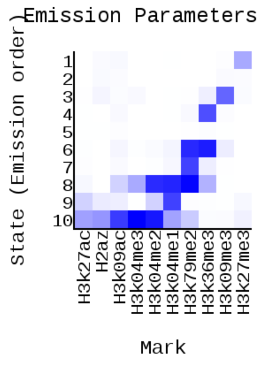
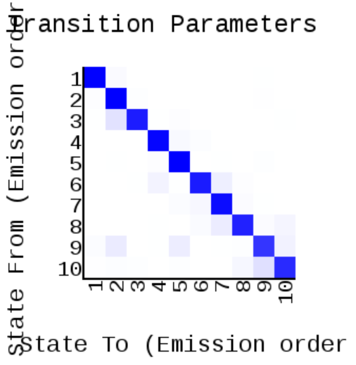
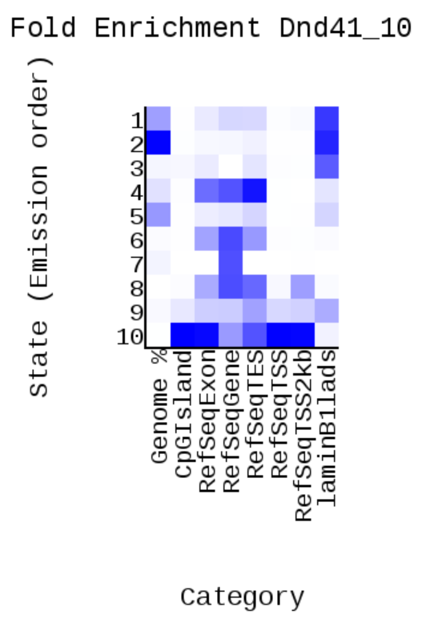
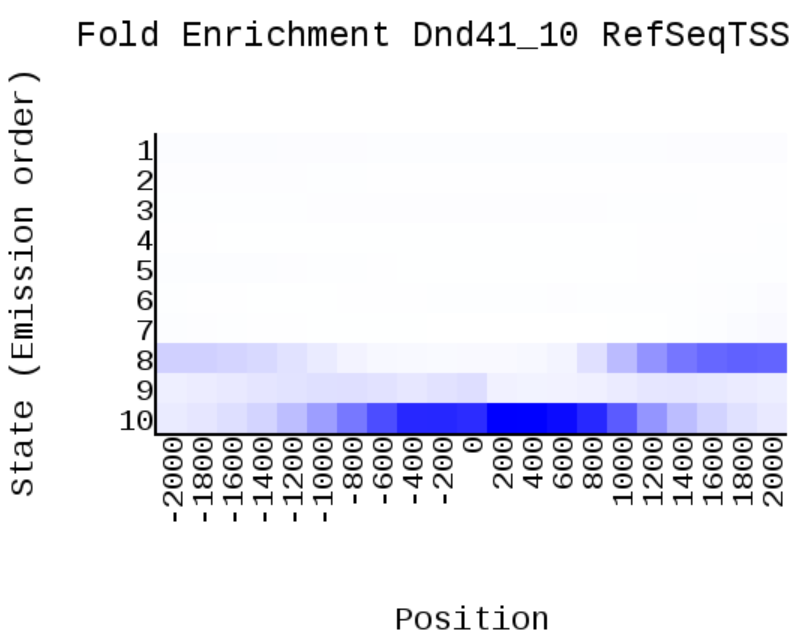
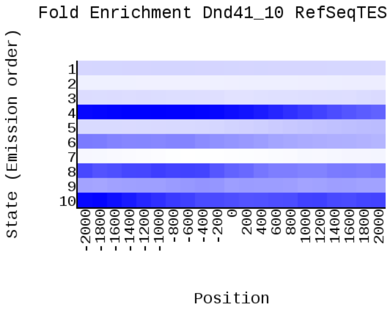
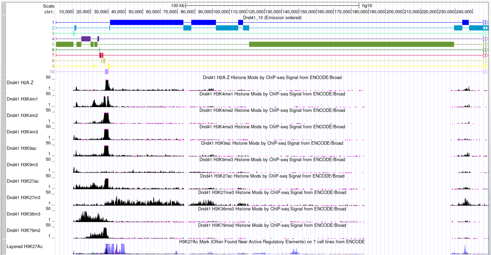

# hse_hw3_chromhmm

### [Colab](https://colab.research.google.com/drive/1tpxKfYi7DGYsXmFVBpf1F0yLX0X1LQMq?usp=sharing)

Клеточная линия (как из прошлой домашки): DND-41

|Метка   |Название файла     |
|:------:|:-----------------:|
|H2AFZ   |H2azAlnRep1.bam    |
|H3K27ac |H3k27acAlnRep1.bam |
|H3K27me3|H3k27me3AlnRep1.bam|
|H3K36me3|H3k36me3AlnRep1.bam|
|H3K4me1 |H3k04me1AlnRep1.bam|
|H3K4me2 |H3k04me2AlnRep1.bam|
|H3k4me3 |H3k04me3AlnRep1.bam|
|H3K79me2|H3k79me2AlnRep1.bam|
|H3K9ac  |H3k09acAlnRep1.bam |
|H3K9me3 |H3k09me3AlnRep1.bam|

### ChromHMM Report

 
 

 

### UCSC Genome Browser

